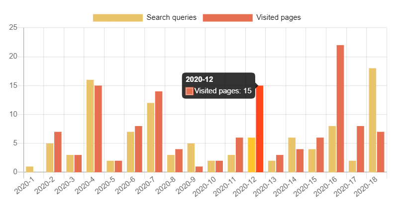
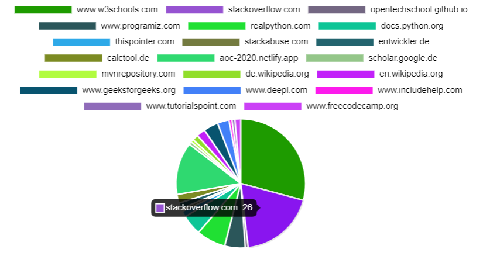

# Browser-History-Difficulty-Measure
Measure the difficulty of a software problem  by evaluating the browser usage while solving the problem.

## Use Case 1 - Advent of Code 2020

### Search and Pages


### Used Pages


## Status
Proposed

## Get started

### Export Browser History
In Chrome browser you can use Plugin "Export Chrome History"

Save history to private/chrome-history.json

### Create Filter
Save arrays of urls to filter in private/filter_url.json
```
["web.whatsapp.com","sso.deutschebank.de"]
```

### Run measurement
```
python measurement.py 
```
###  Open `index.html` in `public`
 


